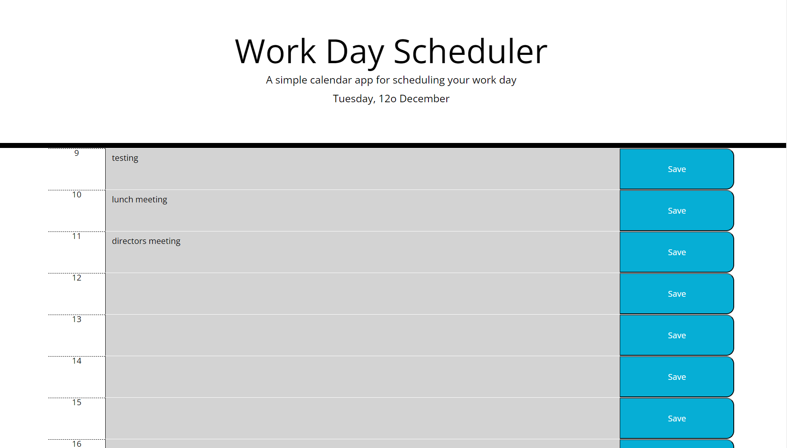

# planisphere

online planner for business time keeping

## Description

Planisphere serves as your digital organizer, offering an intuitive and dynamic platform to plan your daily tasks, events, and appointments. With a clean and user-friendly interface, this planner application simplifies scheduling, ensuring you stay on top of your commitments and manage your time effectively.

## Installation

No installation needed

[Click here to see live copy of the site](https://github.com/lav3ll/planisphere.io)

[Link to quiz wiz js repo](https://github.com/lav3ll/planisphere)

## Usage

**Key Features:**

- Task Management: Organize and manage your tasks seamlessly by scheduling them throughout the day.

- Dynamic Interface: Planisphere dynamically adjusts to your schedule, providing an overview of your planned activities.

- Time Blocks: Allocate specific tasks within hourly time blocks, facilitating better time management.

- Easy Access: Simple navigation and interaction for a hassle-free planning experience.

**Goals and Results:**

Planisphere aims to streamline your day-to-day activities, enhancing productivity and time management skills.

## Credits

Skills For Life
Ed X

## License

MIT License
